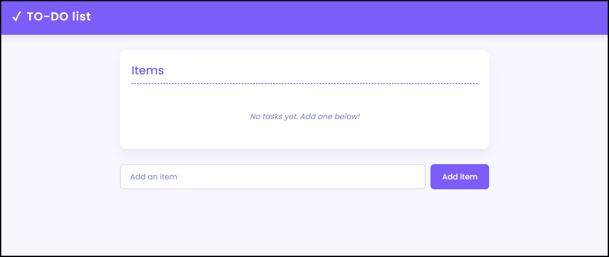

# 🎯 Modern TO-DO List Application

A sleek, responsive to-do list application built with vanilla JavaScript, HTML5, and CSS3. This application allows users to add, display, and remove tasks with a beautiful interface that works across all devices.

## ✨ Features

- **Clean Modern UI**: Sleek design with smooth animations and transitions
- **Responsive Layout**: Works perfectly on mobile, tablet, and desktop 
- **Local Storage**: Tasks persist between browser sessions
- **Intuitive Controls**: Simple interface for adding and removing tasks
- **Real-time Updates**: No page refreshes needed when managing tasks

## 🛠️ Technology Stack

- **HTML5**: Semantic markup structure
- **CSS3**: Custom properties, flexbox, animations, and media queries
- **JavaScript**: ES6+ features for DOM manipulation and local storage

## 🧩 How It Works

The application uses vanilla JavaScript to:
- Render tasks from local storage on page load
- Add new tasks to the list when submitted
- Remove tasks when the delete button is clicked
- Save the current state to local storage after any changes

### Key JavaScript Functions:

- `renderItems()`: Updates the DOM to display current tasks
- `loadItems()`: Retrieves saved tasks from local storage
- `saveItems()`: Saves current tasks to local storage
- `addItems()`: Adds a new task to the list
- `removeItems(idx)`: Removes a task by index

## 📱 Responsive Design

The application features a responsive design that adapts to different screen sizes:
- **Desktop**: Full-width layout with spacious elements
- **Tablet**: Adjusted spacing and element sizes
- **Mobile**: Stacked layout with optimized touch targets

## 🎨 Design Elements

- **Color Scheme**: Vibrant primary colors with clean neutrals
- **Typography**: Modern sans-serif font (Poppins)
- **Animations**: Subtle fade and slide effects for user interactions
- **Visual Feedback**: Hover states and transitions for interactive elements

## 🔮 Future Enhancements

- Task categories/filtering
- Due dates and priority levels
- Dark/light theme toggle
- Drag and drop reordering
- Task completion statistics

## 🙏 Acknowledgements

- Font provided by Google Fonts
- Icons based on Material Design guidelines
- Inspiration from modern web application interfaces
